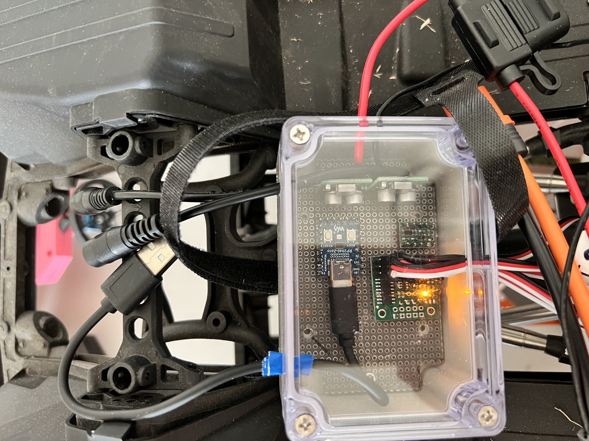
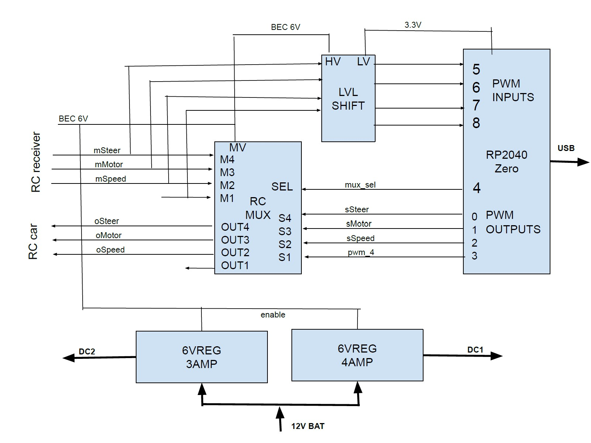

# RoboColumbus2025
Wheeled autonomus robot for 2025 DPRG RoboColumbus competion

This project was started in June 2024 and is expected to have a competitive robot for the RoboColumbus competition in Fall of 2025. I will drive the robot around the field in The Fall of 2024 and maybe have odometry and mapping displayed using ROS2 Rviz2.
https://www.dprg.org/robocolumbus-2024/

# RoboColumbus competition
The basic objective for RoboColumbus are:
-Three orange cones, designated as home, target, and challenge, are placed
outdoors approximately 100 yards from each other. The course between the home cone and the
target cone is clear of obstacles. The course between the challenge cone to both the home
cone and the target cone contains at least one obstacle that requires the robot to deviate from a
direct path. The challenge is to touch and stop at each cone.
- If multiple contestants find and touch the same number of cones then the total time is used to select the winner.
- Robots run on a field of grasses and some tree/bushes boxes etc for obsticles to avoid. Some pavement is OK.
- GPS coordinates of the 3 traffic cones in the field are provided. There should be obsticals between some of the cones. The owner can create GPS coordinates to avoid obsticles.
- The cones are orange and about 17" high and 7" diameter.
- Robots are NOT allowed on the field before competition.
- Run times are less than 15 Minutes
- Robots checked for weight(65 lbs), size(48x48x60 in), and safety switch compliance.

(https://www.dprg.org/wp-content/uploads/2024/06/robocolumbusplus-20240611-1.pdf)

# Robot platform
The AXIAL RCX6 1/6 scale Jeep rock crawler platform was selected to be used for the robot. This platform allows generous room for sensors and electronics to be added and can be installed into the interior of the Jeep for protection.
https://www.axialadventure.com/product/1-6-scx6-jeep-jlu-wrangler-4x4-rock-crawler-rtr-green/AXI05000T1.html

The motor drive, steering and shift control signals must be multiplexed between the RC receiver and the computer. A module in the engine compartment will be added to perform this with a serial interface to the computer in the Jeep cabin. The RC receiver is powered from the motor controller (facrory default) and the connections to the computer is optional, the module will power up to use the RC receiver signals.

The main battery in the engine compartment will also be used for sensors and computer power. A DC-DC module would be added in the engine compartment with 2 sets of 5V at 3 Amps power leads to the Jeep cabin. Fusing the power from the main battery is added for protection. The control multiplexor and DC converter on one board.

# Power
Tap from 3S 11.1V LiPo battery in engine compartment with a fuse.
Two DC-DC converters/regulators for computer and sensors in sealed box in engine compartment.

# Remote connectivity
- RC transmitter for selecting the recevier or computer  
  When the computer is selected it is used as a kill switch  
  When receiver is selected it is used for manual steering control  
- WIFI for development and debug and course configuration  

# Sensors
## GPS
GPS receiver with optional RTK capbility
Used for primary odometry
## IMU
IMU to provide tilt compensation for sensors and maybe bearing to help GPS
## Camera
Object detection and depth camera
## LIDAR
Optional rotating LIDAR for far obsticle detection and avoidance
## TOF
Time Of Flight sensors on front, rear and optional sides with mm resolution for close obstical avoidance and close cone sensor

# Computer 
- Raspberry Pi4 (or 5) with OS Ubuntu 20.04
- Enbedded PC with Linux or Windows (WSL) with OS Ubuntu 20.04
  
# Software
## ROS2
- ROS2 Humble or Iron versions requires Linux Ubuntu 20.04 OS
- 

# Electronic modules
## Servo switch
This switches the servo and engine ESC signals between the RC receiver and the computer 
Pololu 2807 4-Channel RC Servo Multiplexer (Partial Kit) 
<https://www.pololu.com/product/2807>
## DC-DC converter
This supplies power for the cabin electronics. The 6V allows a protection diode while keeping the voltage above 5V 
Pololu 6V, 2.7A Step-Down Voltage Regulator D36V28F6 
<https://www.pololu.com/product/3783>
## Level shifter
This protects the 3.3V input pins on the micro controller from the 6V signals from the RC receiver 
Pololu Logic Level Shifter, 4-Channel, Bidirectional 2595 
<https://www.pololu.com/product/2595>
## Microcontroller
This selects between the computer in the cabin and the RC receiver. It also relays the steering, throttle and shift signals from the computer and the servos and motor ESC. It also allows the computer to set default ranges etc, and sends statuses back. 
Waveshare RP2040-Zero, a Pico-like MCU Board Based on Raspberry Pi MCU RP2040, Mini ver. 
<https://www.waveshare.com/rp2040-zero.htm>

# New electronics in engine compartment
A waterproof box is mounted to the rear battery holder. This box holds the DC-DC converters for the electronics in the cabin, the servo signal mux and a micro controller to manage the servo switch and send some telemetry to the computer in the cabin. The servo switch defaults to connecting the RC receiver to the motor and servos. 

## Method to switch to computer control
The steering wheel and speed switch on the RC transmitter is used to switch to-from computer control. This must be done with throttle at idle.
- Switch to computer control: Turn steering left (CCW) and press speed switch DN(high) then UP (low)
- Switch to receiver control: Turn steering right and press speed switch DN then UP
## Electronics board
The electronic modules are connected using soldered wires and a 0.1" breadboard cut to fit the waterproff box interior
The RC receiver signals are connected to the MASTER pins of the RC switch module using standard servo cables
The motor and servo signals are connected to the OUT pins of the RC switch module using standard servo cables
The controler pins are hard wired to the SLAVE pins of the RC switch
The controller USB supplies the power only to the micro controller 
The DC-DC converters are inside the waterproof box. The power input from the battery has an in-line fuse which is not in the box to protect the batteries from an electrical short. 
 
 

# Micro controller firmware
The microcontroller firmware is C-code developed using the Arduino IDE. The interface to the controller uses the USB port for a serial communications interface. A simple Json data structure sends data to-from the computer in the cabin over the USB serial interface.
## RC switch interface
### Outputs to RC switch
- Slave select
- Steering servo
- Motor speed/fwd-rev
- High-Low speed select servo
### Inputs from RC switch
- Steering
- High-Low speed select
## JSON messages
### Congfigure messages from the computer
### Runtime controll messages from computer
### Status messages to computer

